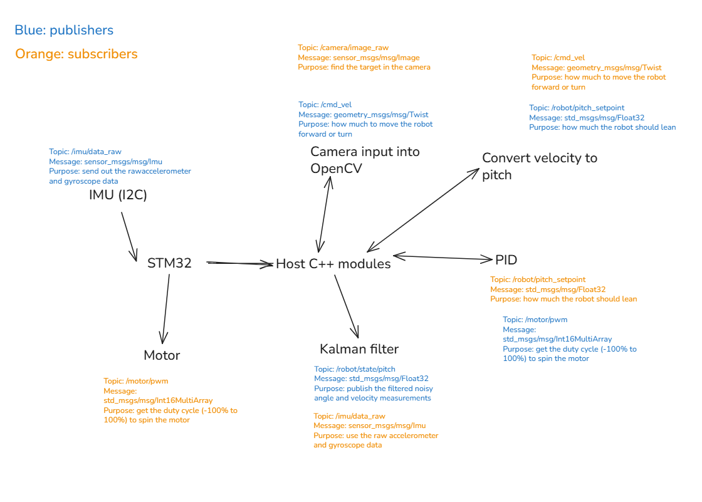

## Overview

Self-rising robot with 2 degrees of freedom.

### Tech Stack

- [MuJoCo](https://mujoco.org/): physics simulation for robot
- Python
- ROS2

### Architecture



Nodes:
- IMU - gyroscope and accelerometer data 
- Kalman filter and state estimation 
- Proportional integral derivative (PID) controller
- STM32 embedded system (in progress)
- Camera input using OpenCV (in progress)

### Docs

- [Daily Log](docs/log.md)
- [Progress Photos](images)

## Setup

### Initial Setup

Ensure you change your filepath to match your workspace.
```
sudo apt install ros-jazzy-robot-state-publisher -y
sudo apt install ros-jazzy-foxglove-bridge -y
source /opt/ros/jazzy/setup.bash
colcon build
echo "source /opt/ros/jazzy/setup.bash" >> ~/.bashrc
echo 'alias devbot="cd <filepath-to-the-repo>/balance-bot && source install/setup.bash"' >> ~/.bashrc
source ~/.bashrc
colcon build --symlink-install
chmod +x record_topics.sh
```

### Each Session

#### Every time you open a new terminal

```
devbot
```

#### Every time you add new files 

Because of the --symlink-install flag from the initial setup, you don't need to run `colcon build` every time you modify existing files.

```
colcon build
```

#### Running nodes

Terminal 1:

```
ros2 launch edge_robot bringup.launch.py
```

Terminal 2:

This script will record the data published by each node into log files. 

```
./record_topics.sh
```

### Foxglove Visualization

Setup:

1. Go to app.foxglove.dev
2. Open connection > Foxglove WebSocket
3. ws://localhost:8765 > Open

Panels:

- **Graph of motor positions**: Add Panel > Plot > Series > Y value > /joint_states > position[0]
- **3D robotic arm:** Add Panel > 3D 
  - Frame: base_link
  - Topics: /robot_description 
- **CPU and memory usage:** Add Panel > Raw Messages > /system_metrics.data