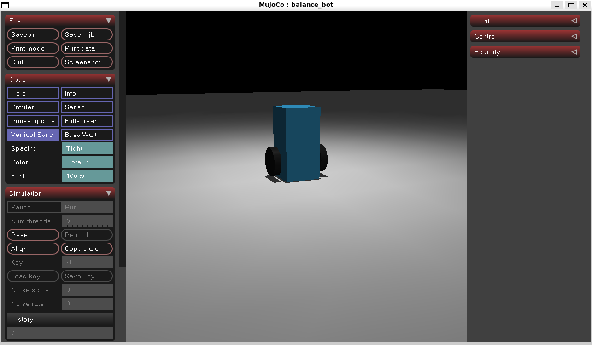

## Next session

- Implement Kalman filter

## Sept 23, 2026

- Set up ROS2 jazzy

## Sept 22, 2026

- Set up mujoco
    - Was having trouble installing mujoco in the venv since VS Code was mixing up Windows and WSL file systems
- Created robot XML
    - Added the chassis, IMU, wheels, motors, gyroscope (sensor for rotation speed), and accelerometer (sensor for linear acceleration)
- Set up basic simulation
    - Data from gyrocope and accelerometer
    - Data from xquat (magnitude and vector components)
    - Convert xquat to pitch (Euler angle)
    - Set the motors to 0 for now
    - Adjust timestep to sync viewer and simulation

