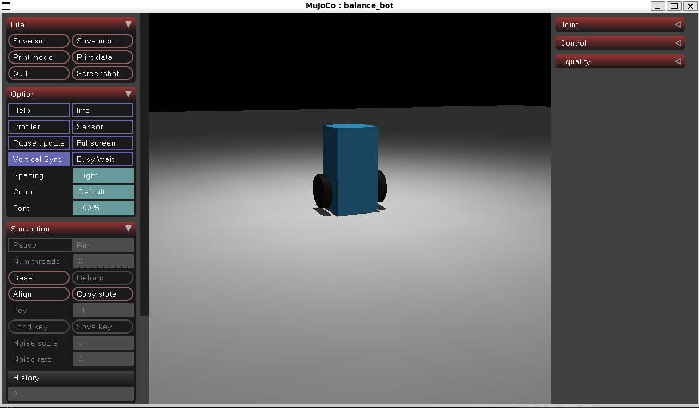

## Next session

## Oct 4, 2026

- Kalman filter
    - Added notes to explain the update method
- State estimator node
    - Kept Kalman filter in separate file to ensure it is agnostic
    - Note: subscriber method needs msg input paramter for the data it is receiving
- Mock IMU node to test Kalman filter and state estimator
- View logs to verify mock IMU
    - Data published by mock IMU node - angular velocity and acceleration
    - Data published by state estimator node - pitch
    - Data published by PID node - PWM values
- Make ROS2 package and restructure folders
    - Automatically start nodes
    - Bash script that will record the data published by each node into files

## Oct 3, 2026

- Kalman filter
  - Added notes to explain each variable and the methods for prediction and updates
  

## Oct 1, 2026

- Kalman filter
  1. Predict the next angle using the current rotation speed. Also account for the bias

## Sept 30, 2026

- PID
  - Was going to use abs() for the error, but then realized that you need the negative sign for the direction that the motor will move in
  - Me forgetting how to do Python and PID 
  ```
  import rclpy
    from rclpy.node import Node

    class PIDNode(Node):
        def __init__(self):
            super().__init__('pid_node')
            total_error = 0
            error = 0
            self.kp = 0
            self.ki = 1
            kp = 1

        def prop_output(self, target_pitch, current_pitch, kp):
            self.error = target_pitch - current_pitch
            return kp * self.error

        # if there is still error after using Kp, Ki will turn the motor until there is no error

        def integral_output(self, total_error, dt, ki):
            output = self.total_error + self.error
            return output

        def total_output(self):
            return self.prop_output(self.kp) + self.integral_output(self.total_error, 1, self.ki)   
    ```

## Sept 24, 2026

- Program and test telemetry node
    - Publish 6 values for the motor position using sine
- Set up Foxglove

## Sept 23, 2026

- Set up ROS2 jazzy
- Program and test observability node; publish the CPU and memory usage
- Program and test video node
    - Camera issues
        - Set up usbipd to connect WSL to the Windows camera
        - Not working; most likely because it doesn't have the uvcvideo driver
        - For other robot projects will run on the actual device (e.g. Raspberry Pi or Jetson) which has Linux instead of WSL from main laptop
    - Decided to use mock video for now

## Sept 22, 2026

- Set up mujoco
    - Was having trouble installing mujoco in the venv since VS Code was mixing up Windows and WSL file systems
- Created robot XML
    - Added the chassis, IMU, wheels, motors, gyroscope (sensor for rotation speed), and accelerometer (sensor for linear acceleration)
- Set up basic simulation
    - Data from gyrocope and accelerometer
    - Data from xquat (magnitude and vector components)
    - Convert xquat to pitch (Euler angle)
    - Set the motors to 0 for now
    - Adjust timestep to sync viewer and simulation

